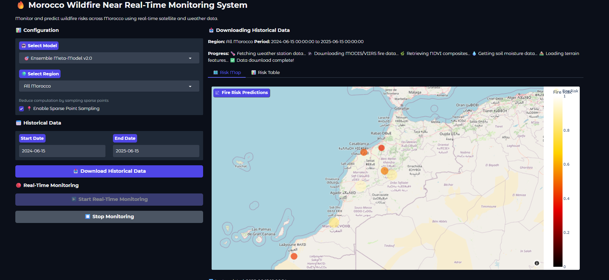
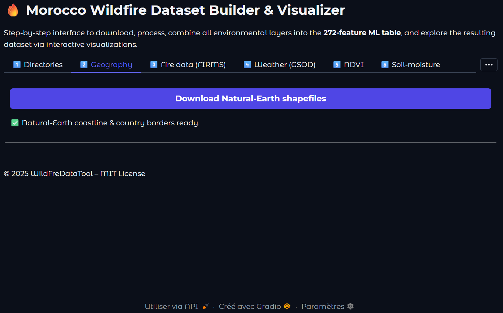
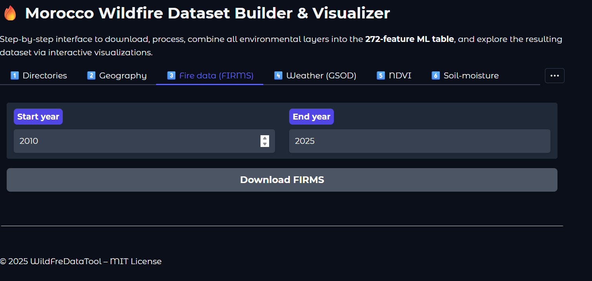
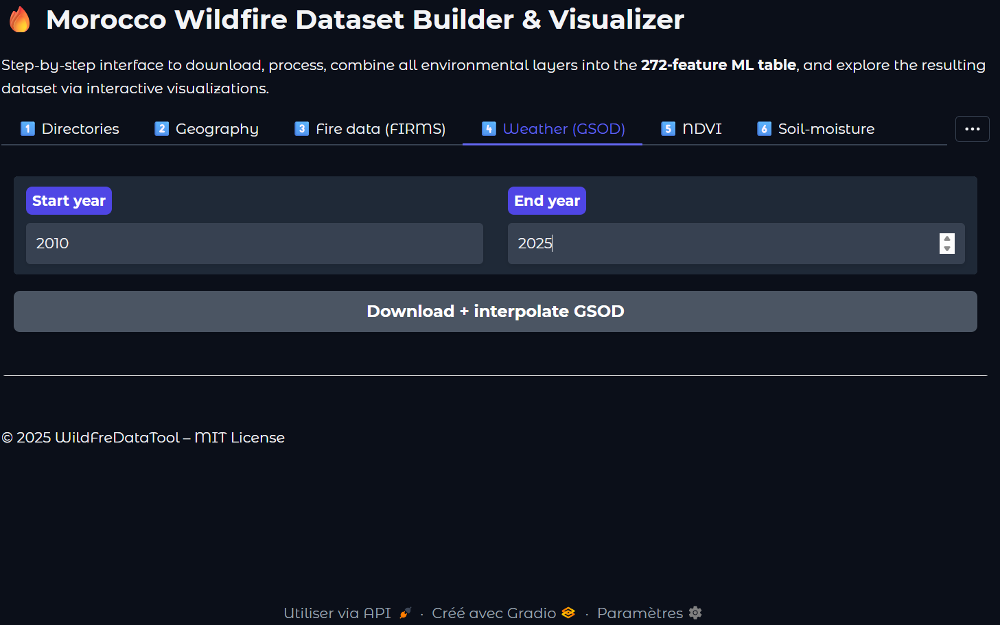
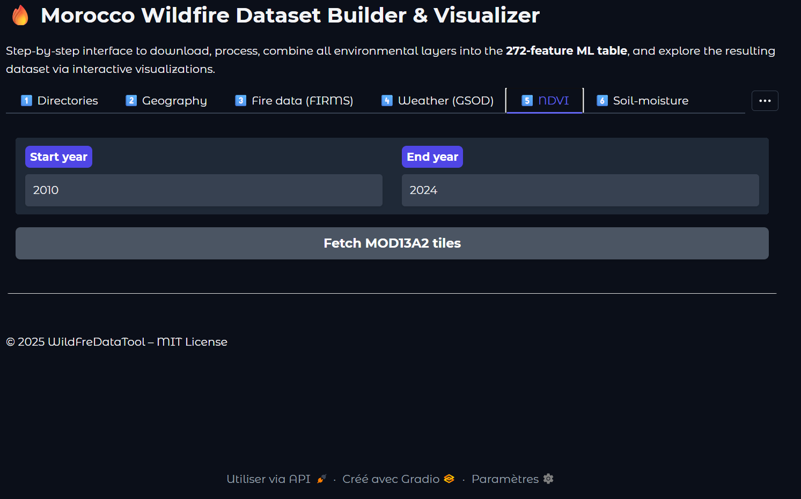
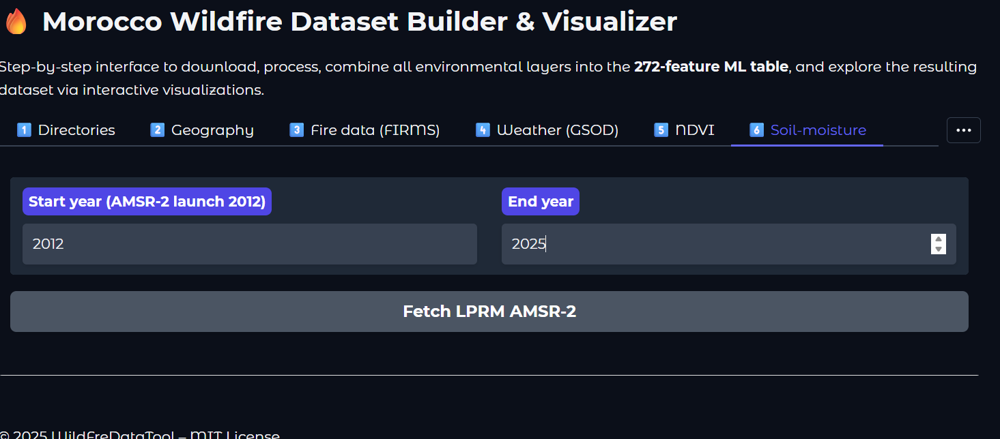
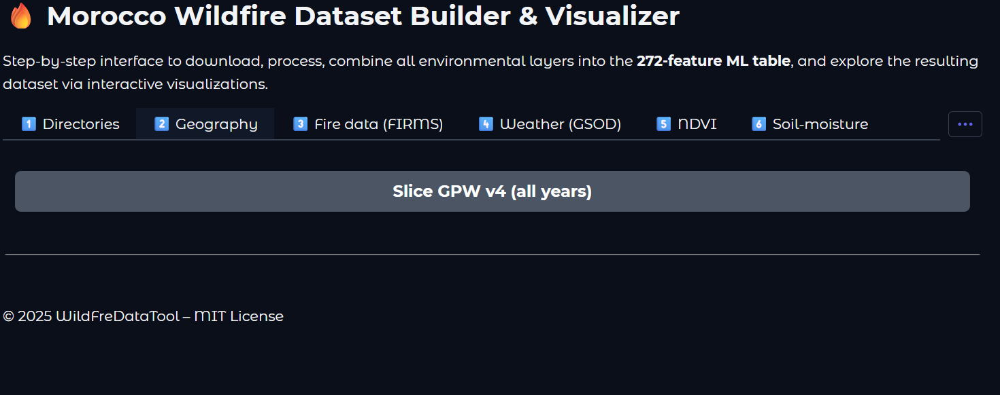
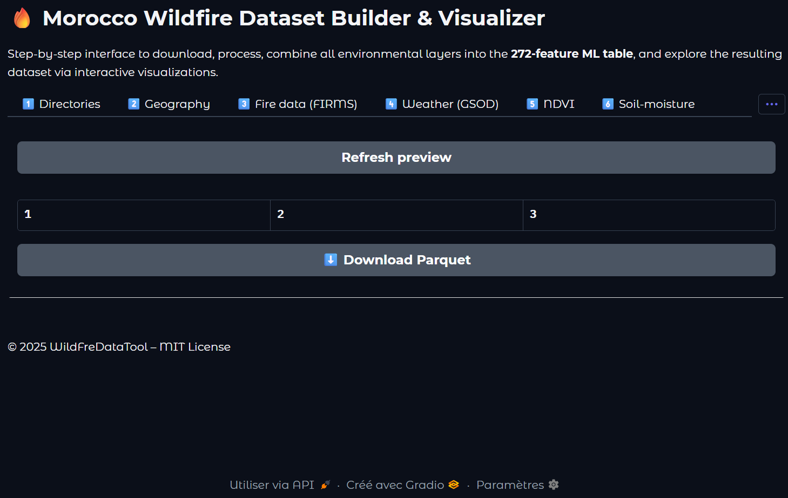
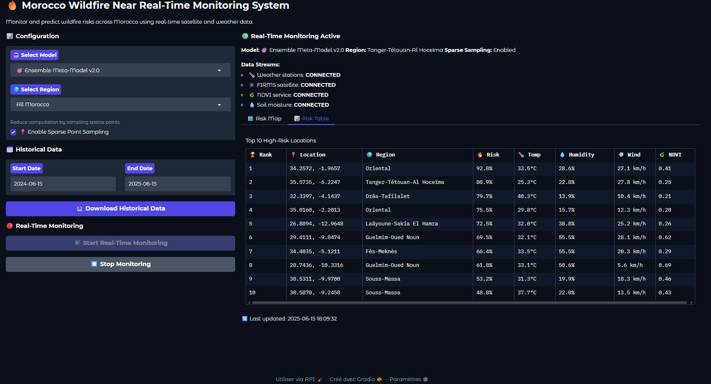

# Morocco Wildfire Data Tool

**End‑to‑end open‑source toolkit for building a 277‑feature ML table (fully compatible with the [Kaggle dataset](https://www.kaggle.com/datasets/ayoubjadouli/morocco-wildfire-predictions-2010-2022-ml-dataset)) and exploring near‑real‑time wildfire‑risk predictions for Morocco.**

<p align="center">
  
</p>

---

## ✨ Key Capabilities

| Capability            | What it does                                                                                                                                                             | Screenshot                                                    |
| --------------------- | ------------------------------------------------------------------------------------------------------------------------------------------------------------------------ | ------------------------------------------------------------- |
| **Dataset Builder**   | Step‑wise GUI that downloads, clips & fuses 6 environmental layers into one tidy Parquet (**277 features + `is_fire` target = 278 cols**).                               |         |
| **Real‑Time Monitor** | Fetches fresh satellite & weather feeds on‑demand, rebuilds features for the chosen region, runs the ensemble model and visualises hotspots on an interactive map/table. |  |
| **Analysis Toolbox**  | Quick correlation heat‑map, scatter‑matrix & EDA helpers directly inside the browser – no Jupyter required.                                                              |          |

---

## 🗂 Project Layout

```text
├── dataset_builder/        # ETL modules (Geo, FIRMS, GSOD, NDVI, Soil, Pop)
├── nrt_monitor/            # ingest → engineer → predict pipeline
├── frontend/               # Gradio apps (builder_ui.py | nrt_ui.py)
├── feature_store/          # rolling buffers & helper classes
├── fetchers/               # low‑level API wrappers (e.g. GFS, Open‑Meteo)
├── docs/                   # this README + images
└── data/                   # raw, processed, output (created at runtime)
```

Directory details can also be found in **[`project-structure.md`](project-structure.md)**.

---

## 🚀 Quick‑start

```bash
# 1 – clone & install
conda create -n wildfire python=3.11  # or use venv/poetry
conda activate wildfire
pip install -r requrements.txt

# 2 – (optional) download pre‑trained model (~200 MB)
./scripts/get_model.sh               # puts weights under models/

# 3 – launch GUI #1 – Dataset Builder
python -m frontend.builder_ui        # http://127.0.0.1:7860

# 4 – launch GUI #2 – Real‑Time Monitor (needs model)
python -m frontend.nrt_ui            # http://127.0.0.1:7861
```

> Both apps can run in parallel; they use independent ports.
> **CLI mode**: run `python cli.py --help` for non‑GUI workflows.

---

## 🏗 Dataset‑Builder Workflow (277 features)

<p align="center">
  
</p>

1. **Geo clip & grid** – 2 km × 2 km nationwide lattice.  
2. **FIRMS fire history** – MODIS & VIIRS CSV ➜ raster stacks.  
3. **Weather (GSOD)** – 2010‑present daily means + lag stats.  
4. **Vegetation (MODIS NDVI/EVI)** – 16‑day composites.  
5. **Soil‑moisture (SMAP LPRM)** – surface & root zone.  
6. **Population (GPW v4)** – yearly density rasters.  
7. **Run full pipeline** – merges everything, computes temporal lags/aggregates, balances the target and writes:
   `data/final/Date_final_dataset_balanced_float32.parquet` **(934 586 rows × 278 cols)**.

Download dialogue preview:


---

## 🔥 Near‑Real‑Time Monitor

*Choose model ▸ choose region ▸ (optional) enable sparse sampling ▸ click "Download Historical Data" or "Start Real‑Time Monitoring".*

| Map mode                                  | Table mode                                  |
| ----------------------------------------- | ------------------------------------------- |
|  |  |

### How it works

```
┌──────── Fetchers (FIRMS, SMAP, Open‑Meteo) ───────┐
│                                                   │
│   async HTTP → /data/cache → Redis message        │
└───────────────┬────────────────────────────────────┘
                │
                ▼
feature_engineering.py  ➜  builds 277‑feature tensor (full grid or sparse mask)
                │
                ▼
model_runner.py (Ensemble v2.0, Keras)  ➜  risk ∈ [0,1]
                │
                ▼
Gradio dashboard updates map markers & high‑risk table
```

*For a deeper dive see* `nrt_monitor/README.md` *(WIP)*.

---

## 📊 Analysis Toolbox

Interactive EDA without notebooks:

```bash
python -m analysis_tools.corr_heatmap data/final/Date_final_dataset_balanced_float32.parquet
```

<details><summary>Example</summary>

</details>

---

## 🖼 Current Version Screens

<p align="center">
  
</p>

> *Latest UI build – "vusiqliwer" internal snapshot.*

---

## 🛤 Roadmap

| Milestone                                                        | Status |
| ---------------------------------------------------------------- | ------ |
| **Dockerised micro‑services** (ingest ▪ features ▪ predict ▪ ui) | ☐ todo |
| Continuous headless ingest (Redis Streams)                       | ☐ todo |
| PostGIS + MinIO storage backend                                  | ☐ todo |
| Nightly Airflow retraining & MLflow registry                     | ☐ todo |
| Edge/offline bundle (SQLite + TFLite)                            | ☐ todo |
| Auth & multi‑user roles                                          | ☐ todo |
| SAR & Sentinel‑2 burn‑scar layers                                | ☐ todo |

---

## 🤝 Contributing

1. Fork → create feature branch → commit → PR.
2. Ensure `make test` passes (pytest + flake8).
3. New modules must include type hints & docstrings.

---

## 📚 Publications & Citations

Please cite the following works if you use this toolkit or the associated dataset:

```bibtex
@inproceedings{jadouli2022human,
  title={Detection of Human Activities in Wildlands to Prevent the Occurrence of Wildfires Using Deep Learning and Remote Sensing},
  author={Jadouli, Ayoub and El Amrani, Chaker},
  booktitle={Networking, Intelligent Systems and Security},
  pages={3--17},
  year={2022},
  publisher={Springer},
  doi={10.1007/978-981-16-3637-0_1}
}

@article{jadouli2023bridging,
  title={Bridging Physical Entropy Theory and Deep Learning for Wildfire Risk Assessment: A Hybrid Pretraining and Fine-Tuning Approach with Satellite Data},
  author={JADOULI, Ayoub and EL AMRANI, Chaker},
  journal={Preprint},
  year={2023}
}

@article{jadouli2024enhancing,
  title     = {Enhancing Wildfire Forecasting Through Multisource Spatio-Temporal Data, Deep Learning, Ensemble Models and Transfer Learning},
  author    = {Ayoub Jadouli and Chaker El Amrani},
  journal   = {Advances in Artificial Intelligence and Machine Learning},
  volume    = {4},
  number    = {3},
  pages     = {2614--2628},
  year      = {2024},
  doi       = {10.54364/AAIML.2024.43152}
}

@article{jadouli2024advanced,
  title={Advanced Wildfire Prediction in Morocco: Developing a Deep Learning Dataset from Multisource Observations},
  author={Jadouli, Ayoub and El Amrani, Chaker},
  journal={IEEE Access},
  year={2024},
  publisher={IEEE},
  doi={10.1109/ACCESS.2024.0429000}
}

@article{jadouli2024pmffnn,
  title={Parallel Multi-path Feed Forward Neural Networks (PMFFNN) for Long Columnar Datasets: A Novel Approach to Complexity Reduction},
  author={Jadouli, Ayoub and Amrani, Chaker El},
  journal={arXiv preprint arXiv:2411.06020},
  year={2024}
}

@article{jadouli2025physics,
  title={Physics-Embedded Deep Learning for Wildfire Risk Assessment: Integrating Statistical Mechanics into Neural Networks for Interpretable Environmental Modeling},
  author={JADOULI, Ayoub and EL AMRANI, Chaker},
  journal={Research Square Preprint},
  year={2025},
  note={Version 1, 08 April 2025},
  doi={10.21203/rs.3.rs-6404320/v1}
}

@article{jadouli2025intenalworld,
  title={Deep Learning with Pretrained'Internal World'Layers: A Gemma 3-Based Modular Architecture for Wildfire Prediction},
  author={Jadouli, Ayoub and Amrani, Chaker El},
  journal={arXiv preprint arXiv:2504.18562},
  year={2025}
}

@incollection{jadouli2025hybrid,
  author    = {Ayoub Jadouli and Chaker El Amrani},
  title     = {Hybrid Parallel Architecture Integrating FFN, 1D CNN, and LSTM for Predicting Wildfire Occurrences in Morocco},
  booktitle = {Soft Computing Applications -- Proceedings of SCA 2024},
  series    = {Lecture Notes in Networks and Systems},
  volume    = {1310},
  year      = {2025},
  publisher = {Springer},
  address   = {Cham},
  doi       = {10.1007/978-3-031-88653-9_16}
}

@misc{ayoub_jadouli_chaker_el_amrani_2024_kaggle_dt,
  title={Morocco Wildfire Predictions: 2010-2022 ML Dataset},
  url={https://www.kaggle.com/dsv/8040722},
  DOI={10.34740/KAGGLE/DSV/8040722},
  publisher={Kaggle},
  author={Ayoub Jadouli and Chaker El Amrani},
  year={2024}
}

@misc{jadouli_data_prep_2024,
  author={Ayoub Jadouli and Chaker El Amrani},
  title = {WildfireForecastingDataPrep},
  url = {https://github.com/AyoubJadouli/WildfireForecastingDataPrep},
  year = {2024},
  note = {Software, main branch commit 50c26ff}
}
```

---

## 📄 License

The code is released under the **MIT License**.  Dataset files remain © Ayoub Jadouli – see Kaggle terms.

---

> **Maintainer:** Ayoub Jadouli  ·  [ajdouli@uae.ac.ma](mailto:ajdouli@uae.ac.ma)  ·  PRs & issues welcome!
